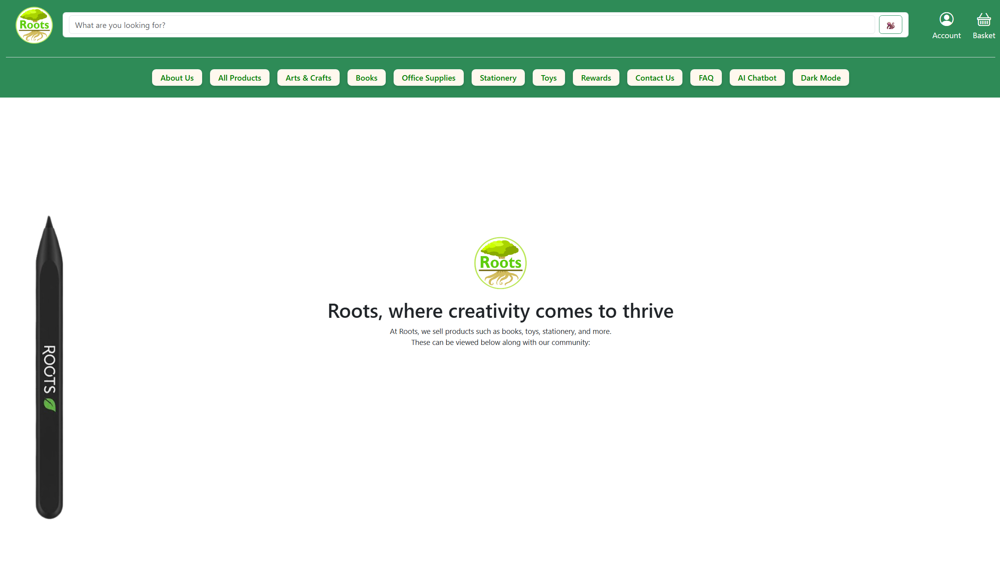
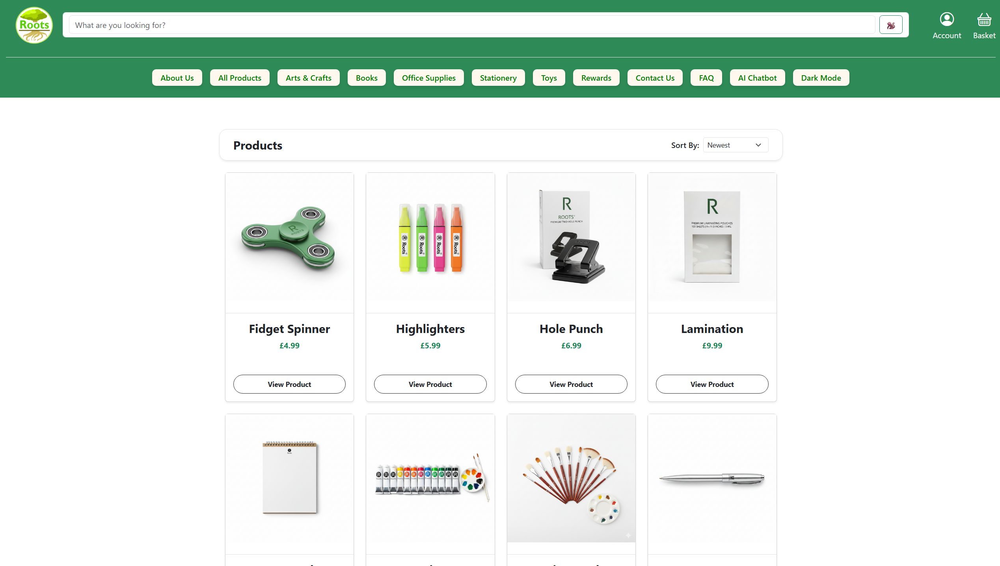
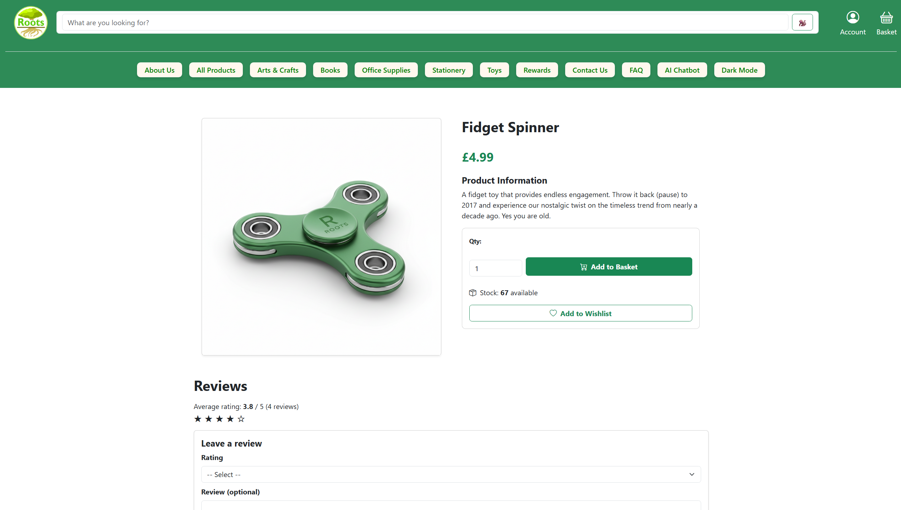
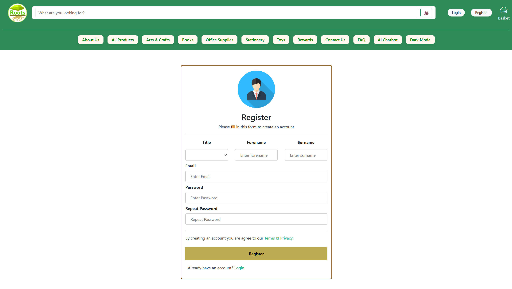
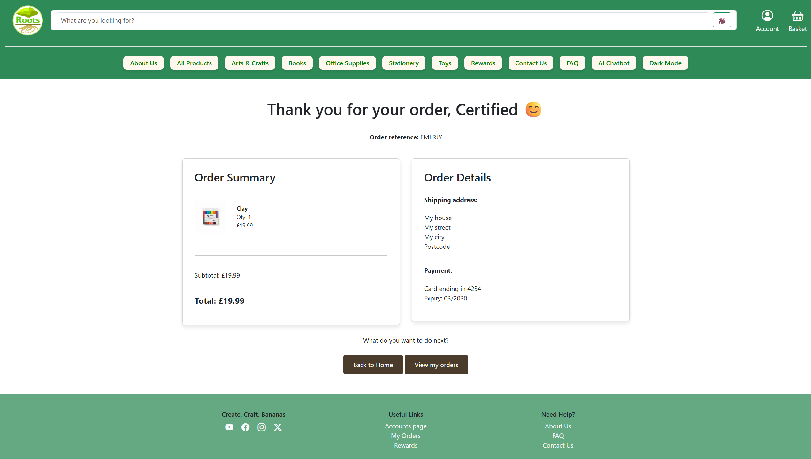

# Project Roots

## Table of Contents
- [About](#about)
- [Features](#features)
- [Demo](#demo)
- [Installation](#installation)
- [Screenshots](#screenshots)
- [License](#license)

## About
Welcome to Team 22's Project Roots, a website for all of your stationery and arts and crafts needs.

## Features
- User-friendly interface
- Curated design with brand identity in mind
- Robust product checkout systems
- Product search functionality
- User account authentication

## Demo
You can check out the live site [here](http://cs2team22.cs2410-web01pvm.aston.ac.uk).

## Installation
To run a local version of the website, do the following:
- Run XAMPP and start the Apache and MySQL servers
- While in the project directory, in a CMD window, type php -S 127.0.0.1:8000 -t public
- In a separate CMD window, type php artisan migrate:fresh --seed to seed the database
- In a separate CMD window, type npm run dev
- Go to 127.0.0.1:8000 and the website should be running

Please note that chatbot functionality is not available when running the website locally.

## Screenshots

**Home page**

 

**Products page**

 

**Individual product page**

 

**Register page**

 

**Order complete page**

## License
This project is licensed under the MIT License. See the LICENSE file for details.